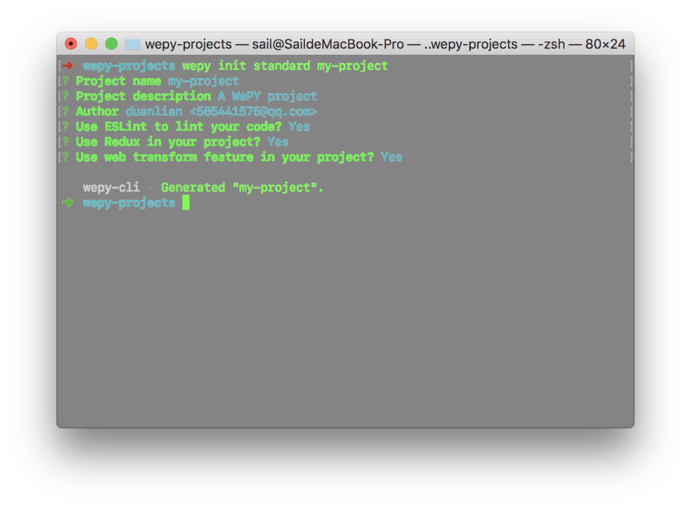
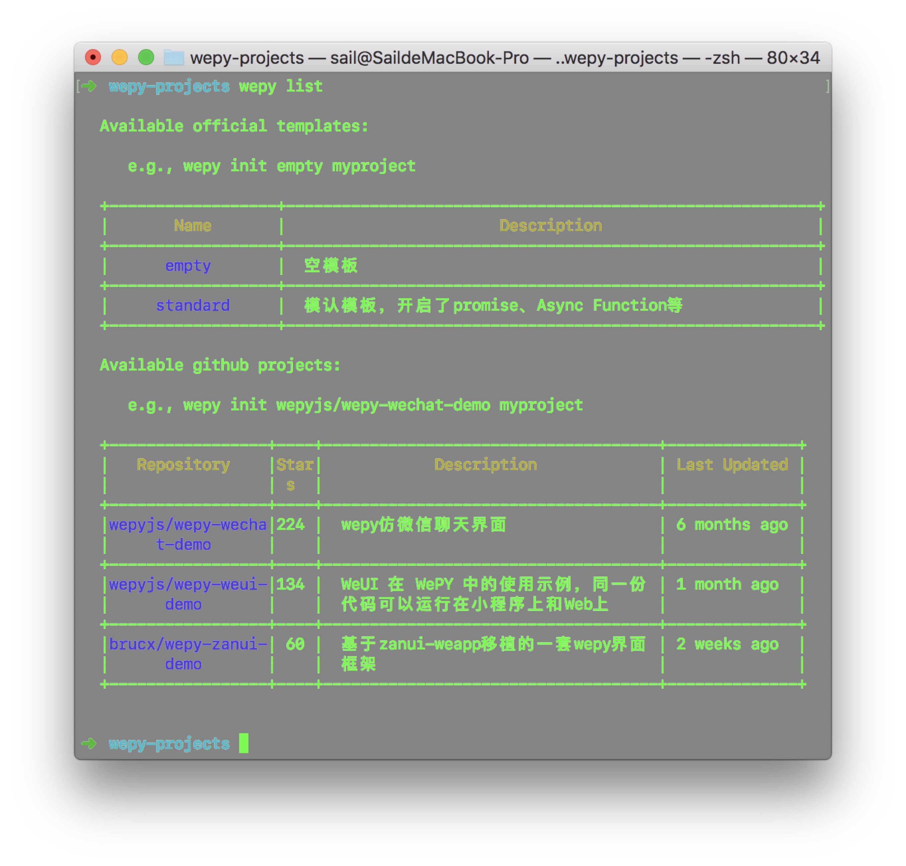

## wepy-cli

> 适用于1.7.0之后的版本

## 安装 (Installation)

``` bash
npm install -g wepy-cli
wepy init standard my-project
```
## 使用 (Usage)

```bash
Commands:

    init [options] <template-name> [project-name]  generate a new project from a template
    build [options]                                build your project
    list [options]                                 list available official templates
    upgrade [options]                              upgrade to the latest version

```

## 拉取模板 (Pulling Templates)

```bash
Usage: init <template-name> [project-name]

  generate a new project from a template


  Options:

    -c --clone  use git clone
    --offline   use cached template
    -h, --help  output usage information

  Example:

   # create a new project with an official template
  $ wepy init standard my-project

   # create a new project straight from a github template
  $ wepy init username/repo my-project
```


## 查找官方/第三方模板资源

``` bash
Usage: list [options]

  list available official templates


  Options:

    -g, --github  list all registered github projects
    -h, --help    output usage information
```



## 编译

```bash
Usage: build [options]

  build your project


  Options:

    -f, --file <file>      待编译wpy文件
    -s, --source <source>  源码目录
    -t, --target <target>  生成代码目录
    -o, --output <type>    编译类型：web，weapp。默认为weapp
    -p, --platform <type>  编译平台：browser, wechat，qq。默认为browser
    -w, --watch            监听文件改动
    --no-cache             对于引用到的文件，即使无改动也会再次编译
    -h, --help             output usage information
```

## 升级wepy-cli

``` bash
Usage: upgrade [options]

  upgrade to the latest version


  Options:

    --cli   upgrade wepy-cli
    --wepy  upgrade wepy
    -h, --help  output usage information
```